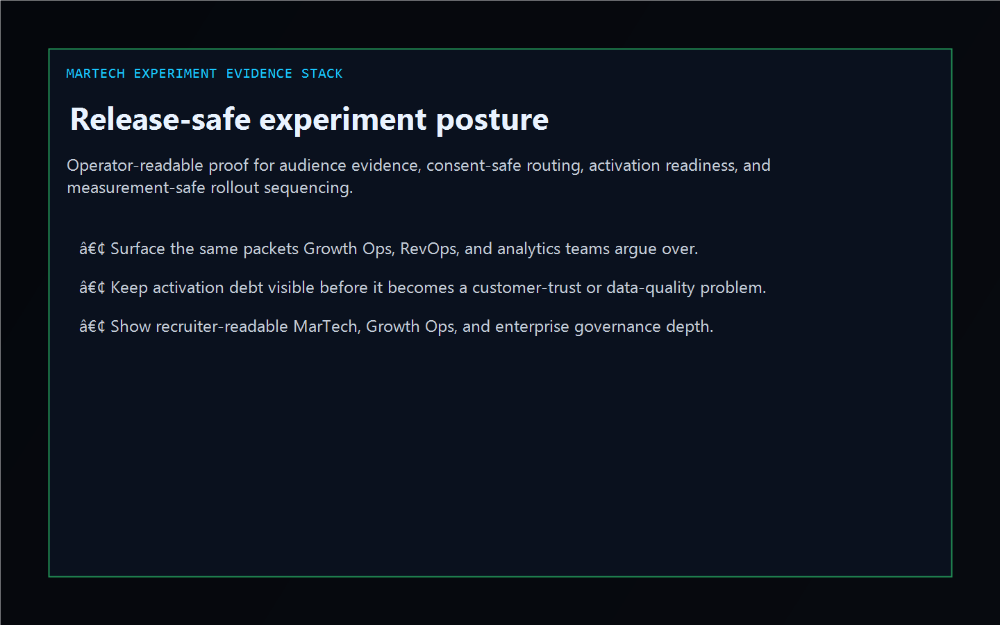
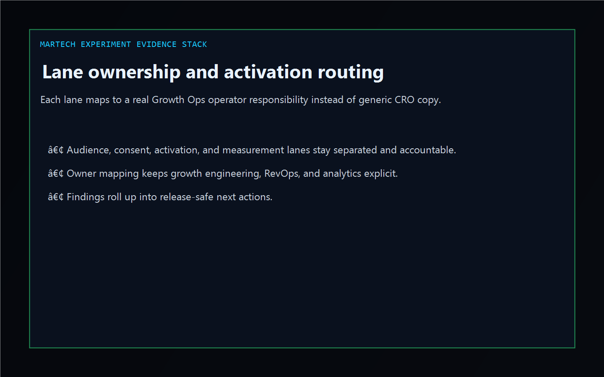
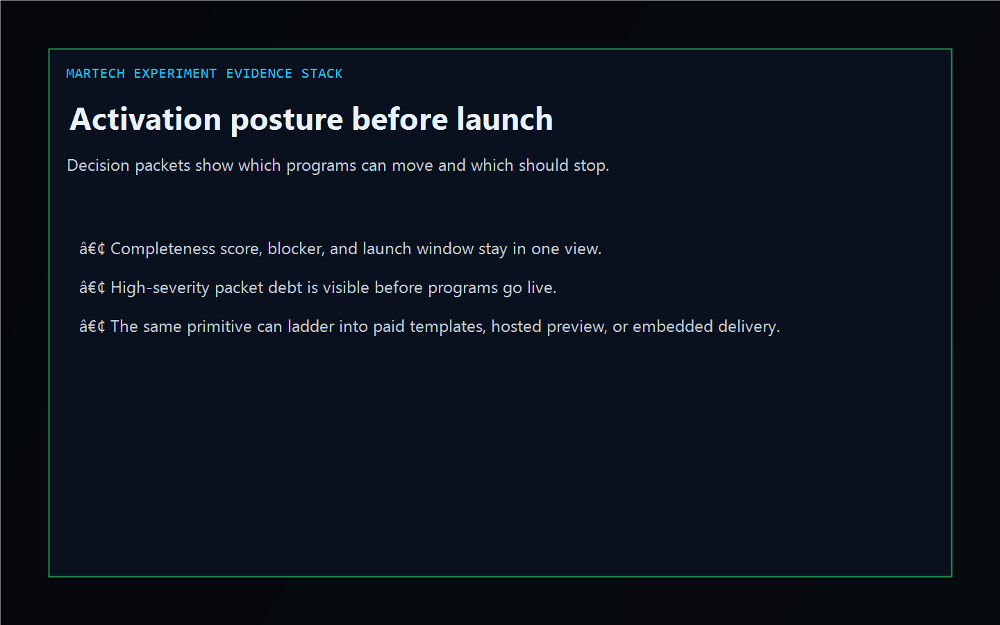

# MarTech Experiment Evidence Stack

[](https://github.com/mizcausevic-dev/martech-experiment-evidence-stack/actions/workflows/ci.yml)
[](https://github.com/mizcausevic-dev/martech-experiment-evidence-stack/actions/workflows/pages.yml)
[](https://github.com/mizcausevic-dev/martech-experiment-evidence-stack/releases/tag/v0.1-shipped)

TypeScript Growth Ops control plane for cross-stack MarTech experiment evidence, consent-safe audience routing, activation readiness, and measurement-safe launch sequencing.

Live surface:

- [martech.kineticgain.com](https://martech.kineticgain.com/)

## Why this exists

- Growth programs usually split audience proof, consent posture, experiment configuration, suppression hygiene, QA approvals, and KPI readiness across multiple tools.
- Buyers still need one operator-readable surface before a launch touches high-volume audiences, trial traffic, pricing pages, or lifecycle branches.
- This repo turns synthetic VWO, Klaviyo, GA4, Snowflake, and CDP-flavored exports into lane, gap, and activation-posture evidence without pretending to be a live tenant control plane.

## Why this matters

This repo demonstrates the cross-stack Growth Ops primitive for enterprise buyers: one evidence layer that joins audience proof, consent integrity, activation blockers, release readiness, and measurement posture. A buyer would care because MarTech workflows often break at the handoffs between platforms, not inside a single UI. Kinetic Gain Embedded extends this into security-first in-product analytics and evidence routing for launch-aware revenue systems, see [kineticgain.com/embedded](https://kineticgain.com/embedded).

## Monetization ladder

- Tier 1 now: public repo, dashboard, analyzer, CLI, and docs surface
- Tier 2 planned: paid activation checklists, evidence ledgers, and experiment handoff templates
- Tier 3 contingent: hosted preview once the hosted rail and billing path are real
- Tier 4 by engagement: embedded Growth Ops evidence-routing and activation-governance delivery

## Surface map

- `/`
- `/stack-lane`
- `/evidence-gaps`
- `/activation-posture`
- `/verification`
- `/docs`

Structured APIs:

- `/api/dashboard/summary`
- `/api/stack-lane`
- `/api/evidence-gaps`
- `/api/activation-posture`
- `/api/verification`
- `/api/sample`

## Screenshots





## Local usage

```powershell
git clone https://github.com/mizcausevic-dev/martech-experiment-evidence-stack.git
cd martech-experiment-evidence-stack
npm install
npm run verify
npm run prerender
npm run render:assets
```

Start the local server:

```powershell
npm run dev
```

Useful routes:

- [http://127.0.0.1:5524/](http://127.0.0.1:5524/)
- [http://127.0.0.1:5524/stack-lane](http://127.0.0.1:5524/stack-lane)
- [http://127.0.0.1:5524/evidence-gaps](http://127.0.0.1:5524/evidence-gaps)

CLI example:

```powershell
npx martech-evidence-audit fixtures/martech-experiment-evidence-clean.json --format summary
```

## Release discipline

| Guardrail | Posture |
| --- | --- |
| Data handling | Synthetic, non-customer-identifying experiment, audience, and packet snapshots only. No live tenant, list, or identity credentials. |
| Deploy | Static prerender -> **https://martech.kineticgain.com/** (GitHub Pages, [pages workflow](./.github/workflows/pages.yml)) |
| SEO | `robots.txt`, `sitemap.xml`, canonical routes, and crawlable docs included |
| Theme | Dark Kinetic Gain operator shell aligned to the current public dashboard standard |
| Tests | `npm run verify` covers lint, typecheck, vitest coverage, build, demo, and smoke |

## Platform note

This is an independent operator-surface demonstration for teams working across MarTech, experimentation, audience governance, lifecycle routing, and Growth Ops workflows. It is not an official vendor site, SDK, or tenant integration.
